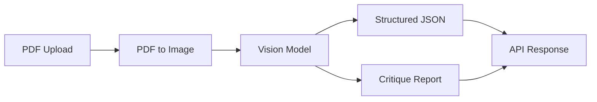

# FirstPass

**AI-powered residential floor plan reviewer.**

Upload a floor plan PDF and receive a structured analysis of rooms, doors, windows, stairs, and dimensions—plus a human-readable critique highlighting potential building-code and design issues.

## Features (MVP)

- **Upload PDF** — Accept residential floor plan PDFs via the web UI or API
- **Analyze floor plan** — Convert PDF pages to images and run vision-model extraction
- **Generate critique report** — Return structured JSON and a readable markdown report

## How it works



1. **Convert** — Each PDF page is rendered to a high-resolution PNG
2. **Extract** — A vision model identifies rooms, doors, windows, stairs, and visible dimensions
3. **Critique** — The system evaluates layout against common residential code and design heuristics
4. **Respond** — Clients receive both machine-readable JSON and a formatted report

## Tech stack

| Layer    | Technology                          |
| -------- | ----------------------------------- |
| Backend  | Python 3.11+, FastAPI, Uvicorn      |
| Frontend | React 18, TypeScript, Vite          |
| PDF      | pdf2image (Poppler)                 |
| AI       | OpenAI GPT-4o vision (configurable) |

## Project structure

```
FirstPass/
├── backend/
│   ├── app/
│   │   ├── api/routes/       # HTTP endpoints
│   │   ├── models/           # Pydantic schemas
│   │   ├── services/         # PDF, vision, report logic
│   │   ├── config.py
│   │   └── main.py
│   ├── tests/
│   ├── requirements.txt
│   └── .env.example
├── frontend/
│   ├── src/
│   │   ├── api/              # API client
│   │   ├── components/       # UI components
│   │   └── types/            # TypeScript types
│   └── package.json
├── docker-compose.yml
└── README.md
```

## Prerequisites

- **Python 3.11+**
- **Node.js 18+**
- **Poppler** (required by pdf2image)
  - macOS: `brew install poppler`
  - Ubuntu: `sudo apt-get install poppler-utils`
- **OpenAI API key** (or compatible vision API)

## Quick start

### 1. Clone and configure

```bash
cd FirstPass
cp backend/.env.example backend/.env
# Edit backend/.env and set OPENAI_API_KEY
```

### 2. Backend

```bash
cd backend
python -m venv .venv
source .venv/bin/activate   # Windows: .venv\Scripts\activate
pip install -r requirements.txt
uvicorn app.main:app --reload --port 8000
```

API docs: [http://localhost:8000/docs](http://localhost:8000/docs)

### 3. Frontend

```bash
cd frontend
npm install
npm run dev
```

App: [http://localhost:5173](http://localhost:5173)

### 4. Docker (optional)

```bash
docker compose up --build
```

## API

### `POST /api/v1/analyze`

Upload a floor plan PDF for analysis.

**Request:** `multipart/form-data` with field `file` (PDF)

**Response:**

```json
{
  "analysis_id": "uuid",
  "filename": "plan.pdf",
  "pages_analyzed": 1,
  "extracted_elements": {
    "rooms": [],
    "doors": [],
    "windows": [],
    "stairs": [],
    "dimensions": []
  },
  "issues": [],
  "report_markdown": "# Floor Plan Review\n\n..."
}
```

## Environment variables

| Variable           | Description                    | Default              |
| ------------------ | ------------------------------ | -------------------- |
| `OPENAI_API_KEY`   | API key for vision model       | —                    |
| `OPENAI_MODEL`     | Vision model name              | `gpt-4o`             |
| `CORS_ORIGINS`     | Allowed frontend origins       | `http://localhost:5173` |
| `MAX_UPLOAD_MB`    | Max PDF upload size (MB)       | `20`                 |
| `PDF_DPI`          | Render resolution for PDF pages| `200`                |

## Development

```bash
# Backend tests
cd backend && pytest

# Frontend lint
cd frontend && npm run lint
```

## Roadmap

- [ ] Multi-page PDF support with page-level summaries
- [ ] Jurisdiction-specific building code rules (IRC, local amendments)
- [ ] Side-by-side annotated floor plan overlay
- [ ] Export report as PDF
- [ ] Batch processing and project history

## Disclaimer

FirstPass provides automated design feedback for informational purposes only. It is **not** a substitute for a licensed architect, engineer, or building official. Always verify findings with qualified professionals and applicable local codes.

## License

MIT
