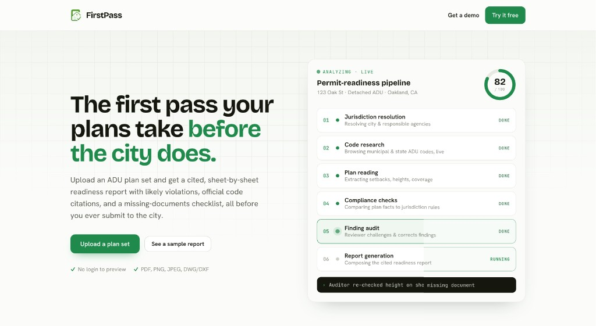

# FirstPass



**AI-powered pre-submission permit-readiness assistant** for residential ADU projects.

Upload a plan set (PDF or DWG), and FirstPass runs a multi-agent pipeline: it resolves the jurisdiction, researches the governing building codes, reads your plans, runs compliance checks, audits the findings, and produces a **cited permit-readiness report** with a score, flagged issues, and a missing-documents checklist.

> FirstPass is a *pre-submission compliance assistant*, not official permit approval. Findings indicate *likely* issues for early correction and require confirmation by a licensed professional and the governing jurisdiction.

**Built for the [UC Berkeley AI Hackathon 2026](https://berkeley.ai)** by Kiro Moussa, Varun Sanjeev, David Pelazini, and Krishiv Bhatia.

**Demo video:** [youtu.be/xaxAYptLR-M](https://youtu.be/xaxAYptLR-M)

---

## The problem

Most residential permit submissions don't pass on the first try. Rules live across municipal portals, state amendments, and PDF code books — technically public, but hard to navigate without a compliance team. Small architecture firms lose weeks (and clients) to avoidable rejections.

FirstPass is the **first pass** a plan set gets before a city plan reviewer sees it: catch likely violations early, with official citations and retrieval dates, in minutes instead of months.

---

## How it works

```
Upload plans → Jurisdiction → Code research → Plan reading → Compliance → Review → Report
```

1. **Jurisdiction** — Resolve the city and responsible agencies from the project address.
2. **Research** — Agents browse official municipal and state code sources (live via Browserbase, or cached corpus in Redis).
3. **Read** — Claude vision extracts structured facts from the plan set (setbacks, height, unit size, sheet inventory).
4. **Comply** — Deterministic checks compare extracted facts against jurisdiction rules.
5. **Review** — An auditor agent challenges findings; Arize evals catch misapplied rules and hallucinations.
6. **Report** — A scored, cited readiness report with PASS / FAIL / WARNING / NEEDS REVIEW per check.

The live **Run** screen shows the pipeline step-by-step: agent activity, tools in use, violations as they stream, and retrieved code sections. When checks finish, open the dashboard to inspect findings on the plan viewer and download the full report.

---

## Sponsor tools (hackathon stack)

FirstPass is built around the hackathon sponsor integrations. Each tool has a visible role in the product — not just a logo in the footer.

| Tool | Role in FirstPass |
|------|-------------------|
| **[Band](https://band.ai)** | Multi-agent orchestration. Python agents (CEO, researchers, visual analysis, compare codes, permit agent) collaborate in a real Band room. The dashboard shows live agent activity and @mention-driven handoffs. |
| **[Browserbase](https://browserbase.com)** | Headless browser for live navigation of official city permitting sites and code portals. Retrieves source URLs, excerpts, and retrieval timestamps for every citation. |
| **[Redis](https://redis.io)** | Shared brain: project state, multi-agent blackboard (`project:{id}:blackboard`), code corpus, and RedisVL hybrid search (vector + BM25) for token-efficient code retrieval. |
| **[Arize](https://arize.com)** | Tracing and evaluation. Runs citation, authority, applicability, and hallucination evals on findings; powers the "caught mistake" demo moment when a misapplied rule is corrected live. |
| **[Claude](https://anthropic.com)** (Anthropic) | Plan reading (vision), agent reasoning, rule interpretation, and report writing. Default model: `claude-haiku-4-5-20251001`. |
| **[Autodesk Platform Services](https://aps.autodesk.com)** | DWG upload, Model Derivative translation, and in-browser plan sheet viewer for `.dwg` uploads. |
| **[Vercel](https://vercel.com)** | Next.js hosting, SSE streaming for live run updates, serverless API routes. |

Every integration **degrades gracefully** — the app runs and demos with zero API keys using cached demo data, in-memory Redis fallback, and prebuilt viewer assets. Add keys in `.env.local` to make each integration go live.

---

## Agent team

Python Band agents (run locally alongside the web app):

| Agent | What it does |
|-------|--------------|
| CEO Boss | Delegates the run and kicks off the workflow |
| Project & Property Manager | Writes the project brief from address + plan metadata |
| Municipal Code Researcher | Scrapes city building codes via Browserbase |
| State Code Researcher | Scrapes California state amendments |
| Code Synthesizer | Merges municipal + state findings into one conclusion |
| Visual Analysis | Reads the plan set with Claude vision |
| Compare Codes | Flags plan-vs-code violations |
| Solutions Agent | Suggests design fixes for flagged issues |
| Permit Agent | Researches the city's permit portal and submittal checklist |

See [`PLAN.md`](./PLAN.md) for the full product spec and [`docs/REDIS_PLAN.md`](./docs/REDIS_PLAN.md) for the Redis blackboard + RAG architecture.

---

## Tech stack

| Layer | Technology |
|-------|------------|
| Frontend | Next.js 15 (App Router), React 19, Tailwind CSS |
| Backend | Next.js API routes, Server-Sent Events for live pipeline streaming |
| Agents | Python 3.11+, [Band SDK](https://pypi.org/project/band-sdk/), Playwright |
| Plan reading | Claude vision (`@anthropic-ai/sdk`), MuPDF for PDF rendering |
| Storage | Redis (ioredis) with in-memory fallback |
| Code retrieval | RedisVL hybrid search + lexical fallback |
| Observability | OpenTelemetry → Arize |
| Deploy | Vercel |

---

## Quick start

```bash
# Web app
npm install
cp .env.example .env.local          # optional — app demos without keys
npm run dev                         # http://localhost:3000

# Python Band agents (optional — for live multi-agent runs)
cp firstpass.config.yaml.example firstpass.config.yaml
uv sync
./scripts/run_agents.sh
```

**Try the demo:** open the app, use the pre-filled Los Angeles ADU address, upload `Los_Angeles_(1).dwg` (or any PDF plan set), and click **Run FirstPass**. The demo pipeline runs real plan reading and compliance against the cached Los Angeles code corpus.

---

## Running Band agents

Start the research agents in parallel:

```bash
./scripts/run_agents.sh
# or individually:
uv run firstpass-municipal
uv run firstpass-state
uv run firstpass-synthesizer
uv run firstpass-compare
```

Kick off a run in Band (address only):

```
@varbtw/ceo-boss @varbtw/project-property-intake

1216 E 92nd St, Los Angeles, CA 90002
```

Or from the CLI:

```bash
uv run firstpass-kickoff --address "1216 E 92nd St, Los Angeles, CA 90002"
```

**Scrape codes without Band** (no Claude API cost):

```bash
uv run firstpass-local --address "1109 Evelyn Ave, Albany, CA 94706"
```

Output lands in `output/municipal_codes.txt`, `output/state_codes.txt`, and `output/final_summary.txt`.

---

## Environment variables

Copy `.env.example` → `.env.local`. Key integrations:

```bash
ANTHROPIC_API_KEY=          # Claude — plan reading, agents, reports
BROWSERBASE_API_KEY=          # Live code portal navigation
BROWSERBASE_PROJECT_ID=
REDIS_URL=                    # Shared state + code corpus (Upstash works on Vercel)
ARIZE_API_KEY=                # Tracing + finding evals
ARIZE_SPACE_ID=
BAND_API_KEY=                 # Real Band collaboration rooms
APS_CLIENT_ID=                # DWG → viewer translation
APS_CLIENT_SECRET=
```

Full reference: [`.env.example`](./.env.example). Agent registration and Band handles: `BAND_AGENTS.md` (local copy, gitignored).

---

## Deploy

```bash
vercel --prod
```

Add the env vars from `.env.example` in your Vercel project settings. Redis URL should use `rediss://` for Upstash/Redis Cloud.

---

## Project structure

```
src/
  app/              Next.js pages + API routes (run, plans, projects, ingest)
  components/       Dashboard, RunProgress, PlanSheetViewer, AgentFeed, …
  lib/              Pipeline, compliance engine, Redis store, integrations
  firstpass/        Python Band agents + Browserbase tools
data/demo/          Prebuilt Los Angeles plan set + viewer cache for zero-config demos
scripts/            Agent runners, code indexing, demo viewer builder
docs/               Redis plan, chunking strategy
```

---

## Disclaimer

> FirstPass is a pre-submission compliance assistant, not an official permit review. Findings indicate *likely* issues for early correction and require confirmation by a licensed professional and the governing jurisdiction. FirstPass does not approve, certify, or guarantee permit approval.

---

## License

Private — UC Berkeley AI Hackathon 2026 submission.
